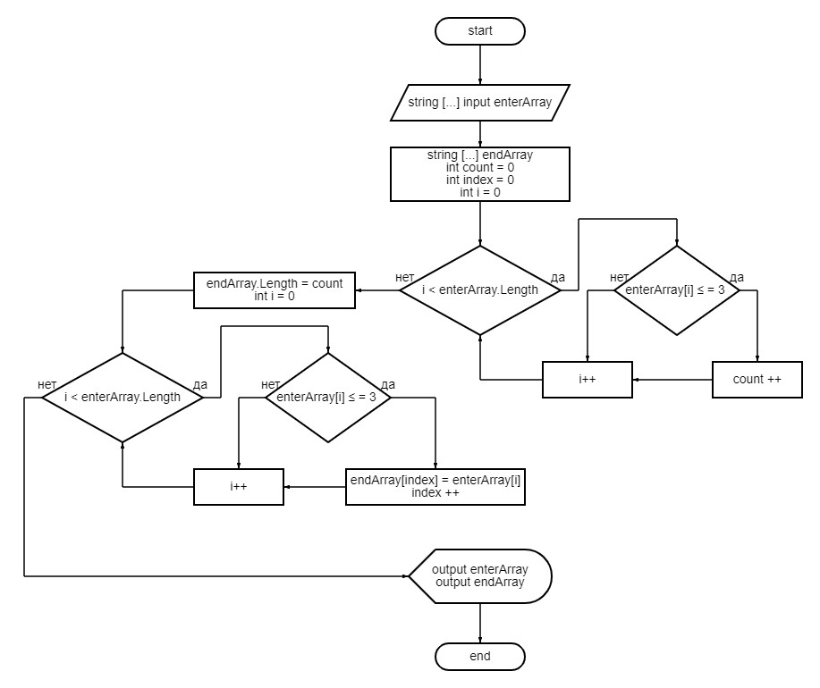

# ИТОГОВАЯ ПРОВЕРОЧНАЯ РАБОТА #
----
## ЗАДАНИЕ ##
1. *Создать репозиторий на GitHub.*
2. *Нарисовать блок-схему алгоритма.*
3. *Снабдить репозиторий оформленным текстовым описанием решения (файл readme.md).*
4. *Написать программу, решающую поставленную задачу.
Использовать контроль версий в работе над этим проектом.*

### УСЛОВИЯ ЗАДАЧИ ###
***Написать программу, которая из имеющегося массива строк формирует новый массив из строк, длина которых меньше, либо равна 3 символам. Первоначальный массив можно ввести с клавиатуры, либо задать на старте выполнения алгоритма. При решении не рекомендуется пользоваться коллекциями, лучше обойтись исключительно массивами.***

    Примеры:   ["hello", "2", "world", ":)"] -> ["2", ":)"]

    ["1234", "1567", "-2", "computer science"] -> ["-2"]

    ["Russia", "Denmark", "Kazan"] -> []

## АЛГОРИТМ РЕШЕНИЯ ##
1. Вводим исходный строковый массив.
2. Последовательно перебираем все значения исходного массива проверяя соответствия условию: длинна значения <= 3 символам.
3. Кладем найденное значение в новый массив.
4. Повторяем пункты 2 и 3 пока не закончится исходный массив.
5. Выводим на консоль исходный и новый заполненный массив как результат работы программы.

## БЛОК-СХЕМА АЛГОРИТМА ##

